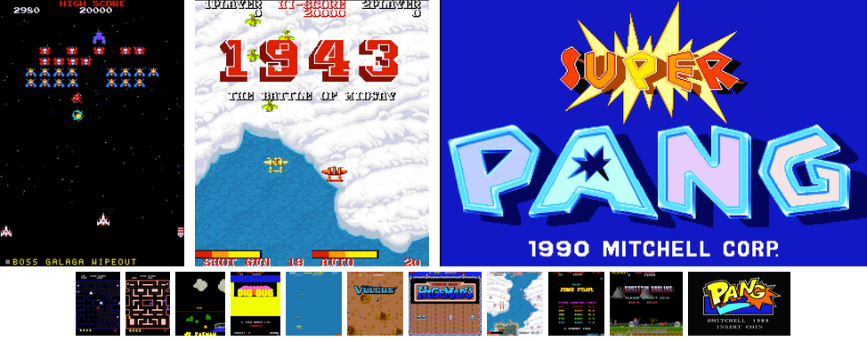
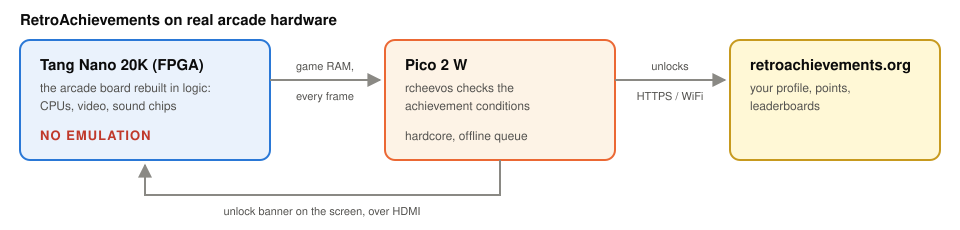

<p align="center"></p>

# game20k: arcade games with RetroAchievements, on real hardware

[](https://github.com/scullymi/game20k/releases/latest)
[](LICENSE)
[](docs/hardware.md)
[](docs/hardware.md)
[](docs/retroachievements.md)

**RetroAchievements on the original arcade circuits, rebuilt in an FPGA. No emulator anywhere.**
A Sipeed Tang Nano 20K recreates the arcade boards in logic, CPUs and sound chips included, and
drives HDMI. A Raspberry Pi Pico 2 W reads the game's RAM every frame, checks the achievements
and shows each unlock as a banner on the screen.



Fifteen games and five regional or speedup sets on eight cores: [docs/games.md](docs/games.md)
lists them with their controls, [docs/images](docs/images/README.md) shows them all.

> **ROMs are not included and never will be.** You need your own, legally obtained ROM sets.

All eight cores live side by side in the board's 8 MB flash, and the menu switches between them
in seconds:


Every core takes 886 KB of its 1 MB slot, the full configuration size of this FPGA. At power-on
the FPGA loads the core at 0x000000. The games themselves are not in the flash: the ROMs load
from the SD card, and every chip is checked against MAME's checksums when the card is prepared.

## RetroAchievements on real hardware



- **Every frame,** the core mirrors the game's RAM to the Pico, and
  [rcheevos](https://github.com/RetroAchievements/rcheevos) checks the conditions there.
- **Unlocks** go to retroachievements.org over HTTPS, wait on the SD card while offline, and
  appear as a banner in the game.
- **Hardcore** by default, with Rich Presence, leaderboards and an achievement list with
  progress in the menu.

You do not need an account to play. Setting one up: [docs/retroachievements.md](docs/retroachievements.md).

## Quick start

**You need** a Tang Nano 20K, a Raspberry Pi Pico 2 W, a microSD card, a micro USB OTG adapter,
a USB arcade stick, an HDMI monitor and seven wires, see [docs/hardware.md](docs/hardware.md).

1. **Wire the boards** as shown in [docs/wiring.md](docs/wiring.md). The 5 V supply goes to
   pin 40 (VBUS) of the Pico.
2. **Get the repository** with the scripts for the SD card:
   ```sh
   git clone https://github.com/scullymi/game20k.git && cd game20k
   ```
3. **Prepare the SD card.** Copy your own MAME sets into `roms/`,
   [roms/README.md](roms/README.md) lists the files each game needs. For WiFi and
   RetroAchievements, fill in `sdcard/config.ini` first, see
   [docs/retroachievements.md](docs/retroachievements.md#account). Then run:
   ```sh
   scripts/make_sdcard.sh /Volumes/YOUR_CARD
   ```
   The script only needs Python 3 and checks every chip against MAME before anything goes onto
   the card.
4. **Flash the Nano.** Download `game20k-<version>-tangnano20k.zip` from the
   [latest release](https://github.com/scullymi/game20k/releases/latest) and write the image:
   ```sh
   openFPGALoader -b tangnano20k -f --verify game20k-<version>-tangnano20k.bin
   ```
5. **Flash the Pico.** Hold BOOTSEL while plugging it in, then copy
   `game20k-<version>-pico2w.uf2` from the same release to the drive that appears.
6. **Play.** Insert the card into the Nano and power on. The screen stays dark until LED 5 lights
   up, which means the ROM has loaded. **S2** on the Nano opens the menu.

The firmware and the image must come from the same release. Building everything yourself:
[docs/BUILD.md](docs/BUILD.md).

## More

| | |
|---|---|
| [Games, controls and menu](docs/games.md) | [RetroAchievements](docs/retroachievements.md) |
| [Hardware and monitor](docs/hardware.md) | [Wiring](docs/wiring.md) |
| [Building from source](docs/BUILD.md) | [Known issues and plans](docs/status.md) |
| [Screenshots and photos](docs/images/README.md) | [Third-party code and credits](THIRD-PARTY.md) |

## Credits

game20k builds on the cores and code of Dar, MikeJ, Rodimus Prime, Jose Tejada Gomez (jotego),
Ace, MiSTer-X, Daniel Wallner, Guy Hutchison, Greg Miller, Till Harbaum, Sameer Puri,
nand2mario, WangXuan95 and RetroAchievements, and on odelot's
[RetroAchievements fork of the MiSTer main program](https://github.com/odelot/Main_MiSTer), which
showed the way on an FPGA. Who wrote what, with links and licences:
[THIRD-PARTY.md](THIRD-PARTY.md).

## Licence, privacy and contact

**GPL-3.0-only** ([LICENSE](LICENSE)), Copyright (C) 2026 scullymi. Third-party parts keep their
own licences, see [THIRD-PARTY.md](THIRD-PARTY.md) and, for individual files,
[docs/BUILD.md](docs/BUILD.md#licences-of-the-files).

game20k runs no servers and collects no data. With a RetroAchievements account, the device talks
to retroachievements.org. [PRIVACY.md](PRIVACY.md) lists what it sends and stores, as well as
the local risks of FTP and telnet.

Questions, bugs, build reports and licence requests: please open an issue in this repository.
