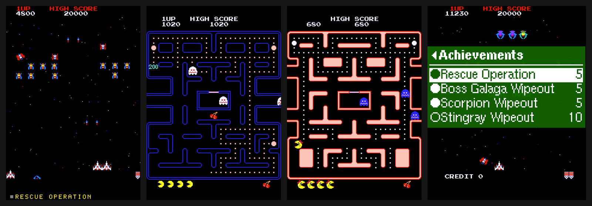
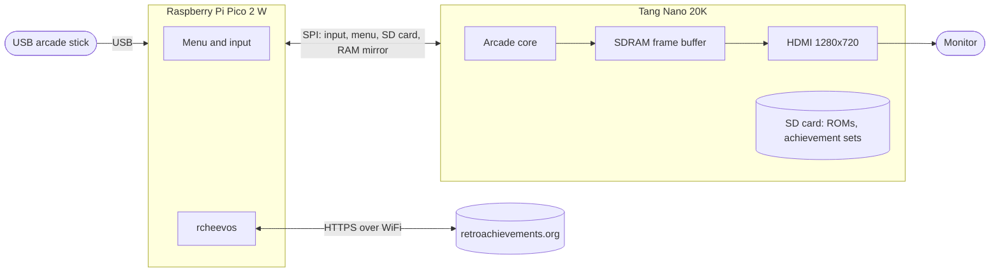
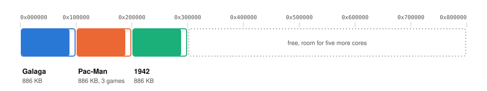

# game20k: arcade on the Tang Nano 20K

[](https://github.com/scullymi/game20k/releases/latest)
[](LICENSE)
[](docs/hardware.md)
[](docs/hardware.md)
[](#retroachievements)

Classic arcade games on a small FPGA board, with **RetroAchievements**. A **Sipeed Tang Nano
20K** recreates the original arcade hardware and drives the HDMI output, while a **Raspberry Pi
Pico 2 W** handles the USB stick, the on-screen menu and the achievements.



More screenshots and a photo of the setup: [docs/images](docs/images/README.md).

> **ROMs are not included and never will be.** You need your own, legally obtained ROM sets.
> Without them, the screen stays dark.

## Games

| Game | Core | MAME set | RetroAchievements |
|---|---|---|---|
| Galaga | Dar's Galaga core | `galaga` (+ `namco54` for the explosions) | [Galaga](https://retroachievements.org/game/12138) |
| Pac-Man | MikeJ's Pac-Man core | `pacman` | [Pac-Man](https://retroachievements.org/game/12192) |
| Puck Man | MikeJ's Pac-Man core | `puckman` | [Perfect Pac subset](https://retroachievements.org/game/24933) |
| Ms. Pac-Man | MikeJ's Pac-Man core | `mspacman` | [Ms. Pac-Man](https://retroachievements.org/game/11800) |

Choose a game under `ROM set` in the menu. A game on the same core restarts straight into it, and
a game on the other core first loads that core from the board's flash.

## Highlights

- **Hardware, not emulation.** The FPGA cores rebuild the arcade boards in logic, Z80 CPUs
  included, rather than emulating them in software.
- **RetroAchievements on an FPGA.** The core mirrors the game's RAM to the Pico every frame, and
  [rcheevos](https://github.com/RetroAchievements/rcheevos) checks the achievement conditions
  there. Unlocks are sent over HTTPS, queued on the SD card while offline, and appear as a banner
  in the game. Rich Presence, leaderboards and an achievement list with progress in the menu are
  included too.
- **Upright or rotated.** 2x upright on a regular monitor, or 3x rotated through an SDRAM frame
  buffer for a monitor turned on its side, which fills the screen as in the original cabinet.
  Both are selectable in the menu (`Upright 2x`, `Landscape 3x`), as are scanlines.
- **Four games, two cores, one flash.** Both cores are stored in the board's flash, and the menu
  switches between them in seconds.
- **No game data in the bitstream.** The ROMs are loaded from the SD card at power-on, and every
  chip is checked against MAME's checksums when the card is prepared.
- **Ready-made releases.** One image for the Nano and one file for the Pico.

## How it works



All cores live side by side in the Tang Nano's 8 MB flash, each in its own 1 MB slot:



Every core takes 886 KB of its slot, because a bitstream always configures the whole FPGA,
whatever the game. At power-on the FPGA loads the core at 0x000000, and the menu switches to the
others.

## Quick start

**You need** a Tang Nano 20K, a Raspberry Pi Pico 2 W, a microSD card, a micro USB OTG adapter,
a USB arcade stick, an HDMI monitor that accepts 1280x720 at 61.03 Hz, and seven wires. See
[Hardware](#hardware) for details.

1. **Wire the boards** as shown in [docs/wiring.md](docs/wiring.md). The 5 V supply goes to
   pin 40 (VBUS) of the Pico.
2. **Prepare the SD card** from your own MAME sets. The script checks every chip and only needs
   Python 3:
   ```sh
   git clone https://github.com/scullymi/game20k.git && cd game20k
   # copy galaga.zip (and namco54.zip), pacman.zip, puckman.zip, mspacman.zip into roms/
   scripts/make_sdcard.sh /Volumes/YOUR_CARD
   ```
   To use WiFi and RetroAchievements, fill in `sdcard/config.ini` first (see
   [RetroAchievements](#retroachievements)).
3. **Flash the Nano.** Download `game20k-<version>-tangnano20k.zip` from the
   [latest release](https://github.com/scullymi/game20k/releases/latest) and write the image:
   ```sh
   openFPGALoader -b tangnano20k -f --verify game20k-<version>-tangnano20k.bin
   ```
4. **Flash the Pico.** Hold BOOTSEL while plugging it in, then copy
   `game20k-<version>-pico2w.uf2` from the same release to the drive that appears.
5. **Play.** Insert the card into the Nano and power on. The screen stays dark until LED 5 lights
   up, which means the ROM has loaded. Press **S2** on the Nano to open the menu.

The firmware and the image must come from the same release. To build everything yourself, see
[docs/BUILD.md](docs/BUILD.md).

## Controls and menu

On the Nano, **S1** resets the game and **S2** opens and closes the menu.

Default stick layout:

| | Button |
|---|---|
| Fire | any button |
| Coin | 9 |
| Start player 1 | 10 |
| Start player 2 | off |
| Volume | menu, Settings |

The button numbers come from the **input test**, a bar at the top of the picture with a labelled
box for every button and direction that lights up while you press it. Switch it on in the menu
under `Controller`, `Input test: On`.
Everything can be changed under `Controller` and kept with `Save settings` under `Settings`.
Otherwise the changes last until power-off.

The `RetroAchievements` menu holds the mode, the achievement list with progress, and the account.
`Mode` switches between hardcore (the default) and softcore. Softcore takes effect immediately.
Switching to hardcore first resets the running game, as RetroAchievements requires, and the
banner shows the mode each time a game starts. In hardcore mode, the server's warning follows,
which reads "Unknown Emulator" until RetroAchievements approves this client. Also in hardcore,
FTP cannot modify the `ra_*` files, the `ra` folder or `config.ini`. `Account` shows the login,
the unlocks and anything still waiting to be sent to the server. Without a connection,
achievements still count: their unlocks are queued on the card and sent once the server can be
reached.

`Status` shows the network and, under `Version`, the firmware version, which is the same one the
firmware reports to RetroAchievements.

To change the game, go to `ROM set` under `Settings`. Choosing a ROM for another game on the same
board, such as `puckman.rom` while Pac-Man is running, restarts the Pico into that game with its
own achievements. Choosing a ROM for a game on the other core, such as `galaga.rom` while Pac-Man
is running, loads that core first. Either way, the menu tells you, and the new game starts after
about three seconds. The choice lasts until power-off, and `Save settings` keeps a ROM of the
same core. Galaga always starts at power-on.

A stick button can open the menu too: set `GAMEPAD_TRIGGER` under `[MENU]` in `config.ini`, see
[sdcard/config.ini.example](sdcard/config.ini.example). This setting counts buttons from 0,
while the input test numbers them from 1, so enter the number shown there minus one (button 1
is 0, button 5 is 4).

## RetroAchievements

You do not need RetroAchievements to play. **With an account**, the firmware downloads the
game's achievement set at startup and keeps it on the card as `ra/<id>/patch.json`, where
`<id>` is the game's RetroAchievements ID (Galaga: `ra/12138/`). This way the set is available
at the next power-up, even without a network. **Without an account**, the device does not
contact the server and downloads nothing. A set that is already on the card still runs, but
its unlocks are neither sent nor kept.

**With an account:**

```sh
cp sdcard/config.ini.example sdcard/config.ini && chmod 600 sdcard/config.ini
```

`sdcard/config.ini` is the only place for credentials. It is the same file that goes onto the SD
card and that the device reads, and `.gitignore` keeps it out of the repository. Enter your WiFi
details under `[WIFI]`. Under `[RA]`, enter your account name and your connect token, and remove
the `;` in front of those two lines.

The connect token is a 16-character key that RetroAchievements issues to clients. The device
logs in with it, so your password is never stored. You only need to get it once:

```sh
curl -s -A 'game20k (token request with curl)' https://retroachievements.org/dorequest.php \
  --data-urlencode 'r=login2' --data-urlencode 'u=YOURNAME' --data-urlencode 'p=YOURPASSWORD'
```

Copy the `Token` field from the reply into `[RA] TOKEN=`. The `-A` option is needed because
RetroAchievements rejects requests with curl's default User-Agent. The web API key in your
account settings is something different and does not work here. A regular account with a
confirmed email address is all you need.

> The token and the WiFi key are stored on the card in plain text, and anyone on your network can
> read them over FTP. Read [PRIVACY.md](PRIVACY.md#local-risks) before lending the cabinet to
> someone.

## Hardware

| Part | Note |
|---|---|
| Sipeed Tang Nano 20K | GW2AR-LV18QN88C8/I7 |
| Raspberry Pi Pico 2 W | stepping **A3 or A4**, printed on the chip as `RP2350A0A3` or `RP2350A0A4`, see [docs/hardware.md](docs/hardware.md#rp2350-stepping-and-erratum-e9) |
| microSD card | FAT32, see [sdcard/README.md](sdcard/README.md) |
| Micro USB to USB A OTG adapter | for the stick on the Pico |
| HDMI monitor | must accept 1280x720 at **61.03 Hz** |
| USB arcade stick (HID) | |
| Perfboard, wire | seven connections, see [docs/wiring.md](docs/wiring.md) |

Sound comes over HDMI. [docs/hardware.md](docs/hardware.md) explains the choice of parts, the
chip stepping, why the Nano's onboard amplifier cannot be used, and the plans for a speaker.

## FAQ

**Is this an emulator?** No. The cores describe the original circuits in VHDL, and the FPGA turns
into those circuits. The Pico only handles input, the menu and the achievements.

**Do I need a RetroAchievements account?** No. Without one, the games run normally, just without
achievements.

**Why don't hardcore unlocks count yet?** RetroAchievements approves each new client manually.
Everything on the device side is ready. Until then, the server records unlocks as softcore and
stores no leaderboard entries.

**Where do I get the ROMs?** From your own arcade boards or another legal source. This project
never ships game data.

**How do I know my ROM set will work?** Run `scripts/make_sdcard.sh`. It checks every chip of
your sets against MAME's checksums and tells you which ones are missing or wrong, before anything
goes onto the card.

## Roadmap

- **Sound through a speaker, in addition to HDMI.** Two options: an I2S amplifier module such as
  the MAX98357A on three free FPGA pins, which first requires an I2S output in the FPGA, or the
  sigma-delta output on pin 77 with an external filter and amplifier, see
  [docs/hardware.md](docs/hardware.md#analogue-sound-optional).
- **More games.** Every arcade board needs its own core, which is shared by all the games that
  ran on that board. Candidates:
  - Namco: Galaxian, Dig Dug, Xevious, Bosconian
  - Capcom, from Jotego's jtcores: 1942, Vulgus, Commando, Gun.Smoke, 1943
  - games with an existing Tang Nano port: Donkey Kong, Defender, Time Pilot, Centipede,
    Pooyan, Bagman, Crazy Climber
- **Hardcore unlocks and leaderboard entries on RetroAchievements,** once RetroAchievements
  approves this client.

## Known issues

- **Hardcore approval.** Unlocks count as softcore until RetroAchievements approves this client.
  Rich Presence, the achievement list in the menu, the hardcore setting that only takes effect
  after a reset, and the chain of proof (device key, ROM digest, set tag, DIP switches applied
  only on reset) are all in place. Plan: request approval from RetroAchievements.
- **FTP without a password.** The FTP server accepts any login, so anyone on the network can read
  and modify the SD card, including `config.ini` with the WiFi key and the RetroAchievements
  token. Telnet on port 23 shows the debug log to anyone on the network. Plan: make FTP and
  telnet switchable in `config.ini`, and check whether FTP can support an optional password.
- **FPGA timing.** The timing report lists 36 endpoints that fail setup. All 25 that it shows are
  on the SDRAM read path, whose clock phase was measured on the board, and the 371 MHz clock of
  the HDMI serializer is not checked at all. The design works on the tested board. Plan: add
  constraints for both paths so that the report covers them, then fix the violations.
- **WiFi.** The firmware only connects via WPA2 and gives up after the attempts at power-on.
  Plan: allow WPA3 networks and keep retrying in the background.

## Credits

game20k builds on the work of others:

- **Dar** (darfpga) for the Galaga core, via
  [DECAfpga/Arcade_Galaga](https://github.com/DECAfpga/Arcade_Galaga)
- **MikeJ** for the Pac-Man core, via
  [MiSTer-devel/Arcade-Pacman_MiSTer](https://github.com/MiSTer-devel/Arcade-Pacman_MiSTer)
- **Daniel Wallner** for the T80, the Z80 CPU in both cores, included in the two repositories
  above
- **Till Harbaum** for [MiSTeryNano](https://github.com/MiSTle-Dev/MiSTeryNano),
  [Nanomig](https://github.com/MiSTle-Dev/Nanomig) and
  [FPGA-Companion](https://github.com/MiSTle-Dev/FPGA-Companion): the SPI link, the menu, SD card
  access and the companion firmware
- **Sameer Puri** for the HDMI core [hdl-util/hdmi](https://github.com/hdl-util/hdmi)
- **nand2mario** for the SDRAM controller of [NESTang](https://github.com/nand2mario/nestang)
- **WangXuan95** for the [SD card reader](https://github.com/WangXuan95/FPGA-SDcard-Reader)
- **RetroAchievements** for [rcheevos](https://github.com/RetroAchievements/rcheevos) and the
  achievement sets
- **odelot** for the RetroAchievements fork of the
  [MiSTer main program](https://github.com/odelot/Main_MiSTer), which showed the way on an FPGA

For who wrote what and under which licence, see [THIRD-PARTY.md](THIRD-PARTY.md).

## Privacy

game20k runs no servers and collects no data. With a RetroAchievements account, the device talks
to retroachievements.org. [PRIVACY.md](PRIVACY.md) lists what it sends and stores, as well as
the local risks of FTP and telnet.

## Licence

**GPL-3.0-only** ([LICENSE](LICENSE)), Copyright (C) 2026 scullymi. Third-party parts keep their
own licences, see [THIRD-PARTY.md](THIRD-PARTY.md) and, for individual files,
[docs/BUILD.md](docs/BUILD.md#licences-of-the-files).

## Author and contact

scullymi on GitHub. Please open an issue in this repository for questions, bugs, build reports
and licence requests.
