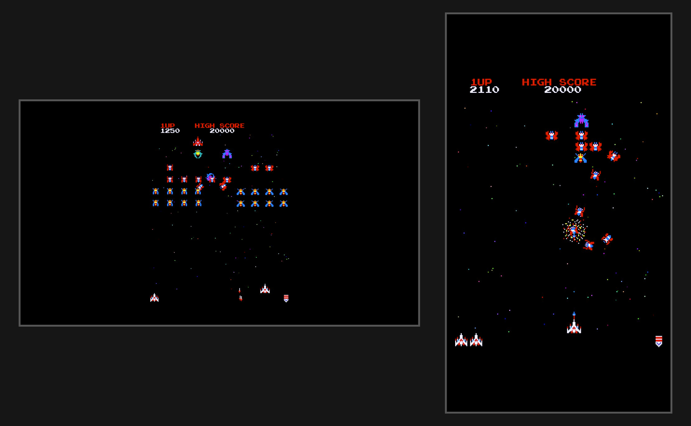
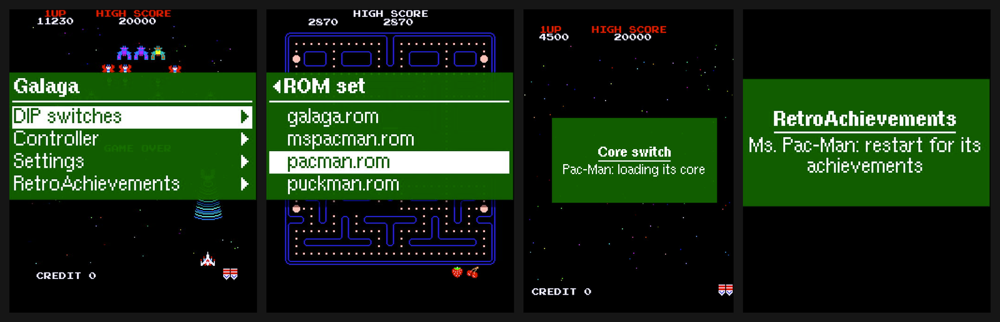

# Games, controls and menu

Every core recreates one arcade board, and the games that ran on the same board share a core.
[roms/README.md](../roms/README.md) lists the files each set needs, and
[images/README.md](images/README.md) shows every game.

## Games

| Game | Core | MAME set | RetroAchievements |
|---|---|---|---|
| Galaga | Dar's Galaga core | `galaga` + `namco51` (+ `namco54` for the explosions) | [Galaga](https://retroachievements.org/game/12138) |
| Pac-Man | MikeJ's Pac-Man core | `pacman` | [Pac-Man](https://retroachievements.org/game/12192) |
| Pac-Man (speedup hack) | MikeJ's Pac-Man core | `pacmanf` | [Pac-Man (speedup)](https://retroachievements.org/game/24885) |
| Puck Man | MikeJ's Pac-Man core | `puckman` | [Perfect Pac subset](https://retroachievements.org/game/24933) |
| Ms. Pac-Man | MikeJ's Pac-Man core | `mspacman` | [Ms. Pac-Man](https://retroachievements.org/game/11800) |
| Ms. Pac-Man (speedup hack) | MikeJ's Pac-Man core | `mspacmnf` | [Ms. Pac-Man (speedup)](https://retroachievements.org/game/24949) |
| Jr. Pac-Man | MikeJ's Pac-Man core | `jrpacman` | [Jr. Pac-Man](https://retroachievements.org/game/12191) |
| Pac-Man Plus | MikeJ's Pac-Man core | `pacplus` | [Pac-Man Plus](https://retroachievements.org/game/11919) |
| Ponpoko | MikeJ's Pac-Man core | `ponpoko` | [Ponpoko](https://retroachievements.org/game/11918) |
| 1942 | jotego's jt1942 core | `1942` | [1942](https://retroachievements.org/game/11960) |
| Vulgus | jotego's jt1942 core | `vulgus` | none |
| Pirate Ship Higemaru | jotego's jt1942 core | `higemaru` | none |
| 1943: The Battle of Midway | jotego's jt1943 core | `1943` | [1943](https://retroachievements.org/game/11961) |
| 1943: The Battle of Midway Mark II | jotego's jt1943 core | `1943mii` | [1943 Mark II](https://retroachievements.org/game/11962) |
| Time Pilot | Ace's Time Pilot core | `timeplt` | [Time Pilot](https://retroachievements.org/game/11902) |
| Ghosts'n Goblins | jotego's jtgng core | `gng` with the "gg" chips, see [roms/README.md](../roms/README.md) | [Ghosts'n Goblins](https://retroachievements.org/game/12149) |
| Makaimura (Japan) | jotego's jtgng core | `makaimurg` | the [Ghosts'n Goblins](https://retroachievements.org/game/12149) set |
| Dig Dug | MiSTer-X's Dig Dug core | `digdug` + `namco51` + `namco53` | [Dig Dug](https://retroachievements.org/game/12091) |
| Pang | jotego's jtpang core | `pang` | [Pang](https://retroachievements.org/game/11996) |
| Buster Bros. (US) | jotego's jtpang core | `bbros` | the [Pang](https://retroachievements.org/game/11996) set |
| Super Pang | jotego's jtpang core | `spang` | [Super Pang](https://retroachievements.org/game/12239) |
| Super Buster Bros. (US) | jotego's jtpang core | `sbbros` | the [Super Pang](https://retroachievements.org/game/12239) set |

## Controls

On the Nano, **S1** resets the game and **S2** opens and closes the menu.

Default stick layout:

| | Galaga, Pac-Man, Dig Dug | 1942, Vulgus, Higemaru | 1943 | Ghosts'n Goblins | Time Pilot, Pang |
|---|---|---|---|---|---|
| Fire (Dig Dug: pump, Ponpoko: jump) | any button | 1 | 1 | 1 | 1 |
| Loop (1942), bomb (Vulgus) | | 2 | | | |
| Bomb | | | 2 | | |
| Jump | | | | 2 | |
| Coin | 9 | 9 | 9 | 9 | 9 |
| Start player 1 | 10 | 10 | 10 | 10 | 10 |
| Start player 2 | off | off | off | off | off |
| Volume | menu, Settings | menu, Settings | menu, Settings | menu, Settings | menu, Settings |

The button numbers come from the **input test**, a bar at the top of the picture with a labelled
box for every button and direction that lights up while you press it. Switch it on in the menu
under `Controller`, `Input test: On`. Everything can be changed under `Controller` and kept with
`Save settings` under `Settings`. Otherwise the changes last until power-off. For 1942, `Sound`
under `Settings` offers `Soft`, which tones down the shrill high notes of the original.

Pang and Super Pang ignore button 2 in the game, as on the arcade board. The Pang core keeps its
settings in the game's test menu (`Service`, `Test mode`). Pang and Buster Bros. confirm there
with start 2, so give `Start 2P` under `Controller` a button first.

A stick button can open the menu too: set `GAMEPAD_TRIGGER` under `[MENU]` in `config.ini`, see
[sdcard/config.ini.example](../sdcard/config.ini.example). This setting counts buttons from 0,
while the input test numbers them from 1, so enter the number shown there minus one (button 1
is 0, button 5 is 4).

## Upright or rotated

A game with a vertical monitor runs 2x upright on a regular monitor, or 3x rotated through an
SDRAM frame buffer for a monitor turned on its side, which fills the screen as in the original
cabinet. Both are selectable in the menu (`Screen`: `Upright 2x`, `Landscape 3x`), as are
scanlines. A game with a horizontal monitor (Higemaru, Ghosts'n Goblins, the Pang core) always
runs 3x, with the menu and the banner upright. The banner appears in the black strip below the
picture. On the Pang core the picture fills the full height of the screen, so the banner sits at
the top of the picture on a black box.

## Changing the game

To change the game, open `Games`, the first entry of the menu. It lists every game on the card
by title. Choosing a game on the running core, such as Puck Man while Pac-Man is running,
restarts the Pico into that game with its own achievements. Choosing a game on another core,
such as Galaga while Pac-Man is running, loads that core first. Either way, the menu tells you,
and the new game starts after about three seconds. `ROM set` under `Settings` still picks a
file by name. The choice lasts until power-off. `Save settings` makes the running game the one
that starts at power-on, otherwise Galaga starts.

Only files that `scripts/make_sdcard.sh` built appear on the list. Each carries a footer with
the game's name and a checksum, which the Pico checks while it loads the game. A file built by
an older release shows `Old ROM file`, so rebuild the card. A file whose content no longer
matches its checksum shows `ROM file damaged` and does not start, so copy it to the card again.

`Status` shows the network and, under `Version`, the firmware version, which is the same one the
firmware reports to RetroAchievements. The `RetroAchievements` menu is described in
[retroachievements.md](retroachievements.md#the-menu).
