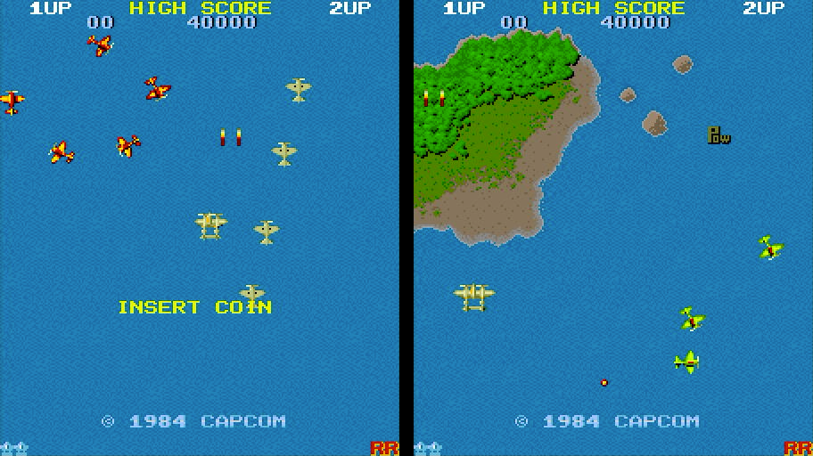
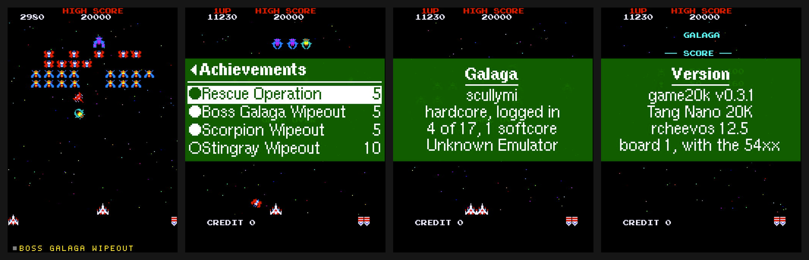
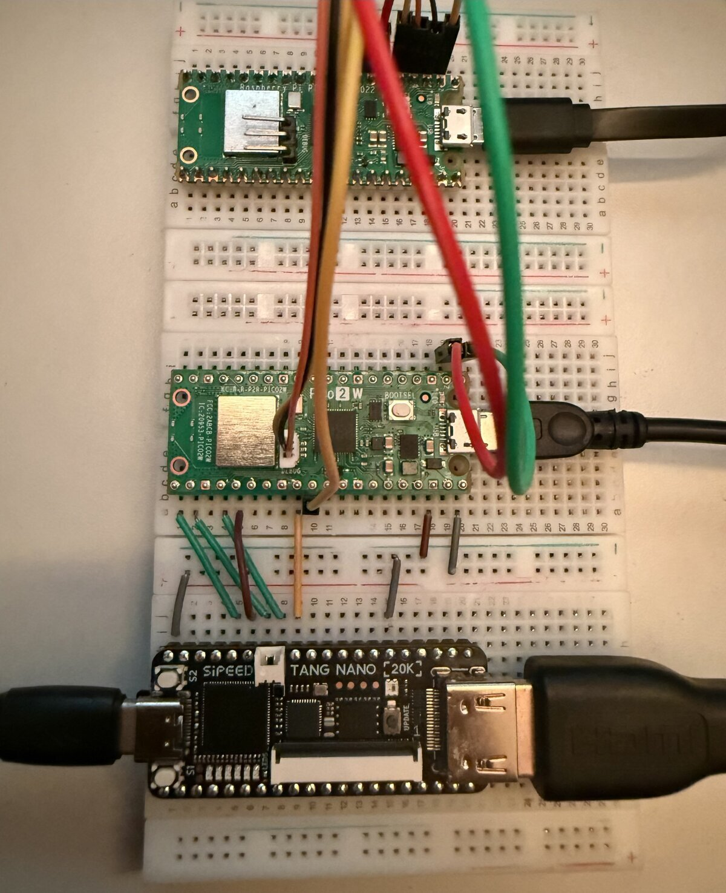

# Screenshots

Captured from the HDMI output of the Tang Nano 20K with a USB capture card, unedited apart from
cropping. The game graphics belong to their publishers.

## The games

Galaga with an achievement banner, Pac-Man, Ms. Pac-Man and the achievement list in the menu.

1942 in its attract mode, upright on a regular monitor (`Upright 2x`).

## Upright or rotated

The same game on a regular monitor (`Upright 2x`) and rotated for a monitor turned on its side
(`Landscape 3x`).

## RetroAchievements

An unlock banner during the game, the achievement list, the account and the version.

## Menu and game switch

The main menu, the choice of ROM, and the messages when the device switches to another core or
another game on the same core.

## The setup

The Tang Nano 20K at the bottom, the Pico 2 W in the middle, and a second Pico as a debug probe
at the top, on a breadboard.

