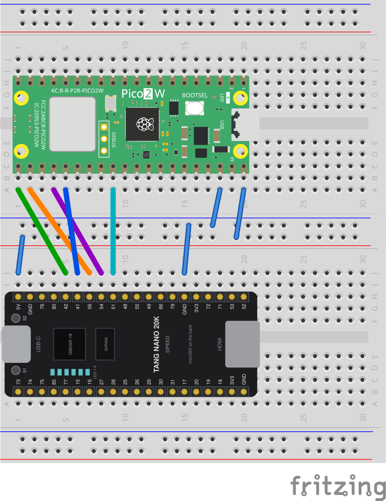

# Wiring: the Companion MCU on the Tang Nano 20K

The Tang Nano 20K has no USB host on the FPGA. The arcade stick is therefore connected to a
Raspberry Pi Pico, which passes the buttons to the FPGA over SPI. There are two ways to connect
the stick to the Pico. The SPI connection is the same for both. Everything runs at 3.3 V, so no
level shifter is needed.



The drawing shows the SPI variant, drawn with Fritzing ([wiring_pico.svg](wiring_pico.svg)).

## SPI connection, same for both variants

Five lines plus ground and supply. The assignment is that of the M0S Dock in the FPGA-Companion
documentation, so the firmware runs unchanged.

| Signal | Print on the Nano | Position, right header | Pico GPIO | Pico pin |
|---|---|---|---|---|
| +5 V | 5V | 1 | VBUS | 40 |
| GND | GND | 2 | GND | 38 |
| MISO | 42 | 5 | GP16 | 21 |
| MOSI | 41 | 6 | GP19 | 25 |
| CSn | 56 | 7 | GP17 | 22 |
| SCK | 54 | 8 | GP18 | 24 |
| IRQn | 51 | 9 | GP22 | 29 |

Positions count from the top, the USB-C side. The right header in full:

**5V, GND, 76, 80, 42, 41, 56, 54, 51, 48, 55, 49, 86, 79, GND, 3V3, 72, 71, 53, 52**

**Two holes stay free between GND and MISO, pins 76 and 80.** Pin 76 goes to the onboard BL616.
The 3V3 of this header is at position 16, not next to the 5 V. The left header, also from the
top:

**73, 74, 75, 85, 77, 15, 16, 27, 28, 25, 26, 29, 30, 31, 17, 20, 19, 18, 3V3, GND**

The pin numbers are printed on the underside only, hidden once the board is plugged in. On early
boards of revision v3920 that print is wrong in several places. There the official schematic
applies.

The supply goes to **VBUS (pin 40)**, not VSYS (pin 39). Only VBUS also feeds the Pico's USB
connector. On VSYS the Pico runs, but a stick on its USB port has no power and never enumerates.

## Variant A: stick on the Pico's own USB port (recommended)

The Pico's micro USB port becomes the host. The stick plugs in through a USB OTG adapter (micro
USB plug to USB A socket).

- No soldering beyond the SPI connection.
- Uses the USB controller in the chip, not the PIO implementation, and is not affected by
  erratum RP2350-E9 (see [hardware.md](hardware.md)).
- Firmware: `scripts/build_companion.sh pico2 native`, or `pico native` for the Pico W.
- To reflash the Pico over USB, unplug the stick. The port is then needed for the computer.
  Also unplug the 5 V line from the Nano, otherwise two 5 V supplies are tied together.

## Variant B: own USB A socket on GP2 and GP3

The Pico generates the USB signal with PIO on two ordinary pins. The stick plugs into a soldered
USB A socket, with no adapter.

| Socket | Pico GPIO | Pico pin |
|---|---|---|
| D+ | GP2 | 4 |
| D- | GP3 | 5 |
| VBUS (5 V) | VBUS | 40 |
| GND | GND | 38 or 23 |

On a USB A socket the contacts are, in order, 5 V, D-, D+, GND. GP2 and GP3 are fixed. The
firmware expects D+ on the lower pin number. Firmware: `scripts/build_companion.sh pico2 pio`,
or `pico pio` for the Pico W.

**Pull-down resistors are mandatory:** one from D+ to GND and one from D- to GND, directly at
the socket. Without them the port works unreliably or not at all.

| Chip | Value | Reason |
|---|---|---|
| RP2350 stepping A2 | 4.7 kOhm | erratum E9, see below. 3.3 to 8.2 kOhm is acceptable |
| RP2350 A3/A4, RP2040 | 15 kOhm | value from the USB specification |

A USB host needs about 15 kOhm to ground on both data lines to detect a device. The native USB
port has these resistors in hardware. Ordinary pins have none. The PIO library relies on the
chip's internal pull-downs, which are 36 to 113 kOhm and far outside the specification.

On the RP2350 stepping A2, erratum E9 adds to this: a pin configured as input with its input
buffer enabled leaks up to 120 uA and sticks at about 2.2 V. The PIO USB library runs the data
lines in exactly that configuration. The host then sees a permanently invalid state and detects
neither plugging nor unplugging. With 4.7 kOhm the stick works on the socket: 120 uA through
4.7 kOhm is 0.56 V, below the low threshold of 0.8 V, and a device pulling up with 1.5 kOhm
reaches 2.50 V, above the high threshold of 2.0 V. With an A2 stepping the stick on variant B
is still often not detected at power-on and has to be replugged. Variant A does not have this
problem. A socket already soldered for variant B can stay while the native firmware runs, since
that firmware does not touch GP2 and GP3.

Recommended for signal quality: 22 Ohm in series at each of GP2 and GP3, D+ and D- twisted,
total length under 10 cm with a ground wire run alongside, 10 uF and 100 nF between VBUS and
GND at the socket. **No** capacitors on D+ or D-.

## Reset button

`RUN` is **pin 30** (eleventh from the top on the right side), with an internal pull-up of about
50 kOhm to 3.3 V. A short to ground resets the chip.

| Button contact | Pin |
|---|---|
| 1 | **30** (RUN) |
| 2 | **28** (GND) |

Both pins are free in this wiring (pins 21, 22, 24, 25, 29, 38 and 40 are in use). Pin 29
between them is IRQn. Do not bridge it when soldering. With the button, *hold BOOTSEL, tap
reset* puts the Pico into the bootloader without unplugging anything.

## Debug port (SWD)

On the Pico W and Pico 2 W three vias sit in the middle of the board, below the radio module:
**SWCLK, GND, SWDIO**. Solder a three-pin header there. With a debug probe (the Raspberry Pi
Debug Probe, or a second Pico with the `debugprobe` firmware) this gives flashing without
BOOTSEL, real debugging (breakpoints, single step, memory inspection), and the serial output of
the firmware, since the probe is also a UART adapter.

Connect only SWCLK, SWDIO and GND. The Pico is powered from the Nano's 5 V, so the probe's own
supply line stays unconnected.

### Which probe

The **Raspberry Pi Debug Probe** comes with three cables, among them the one needed here,
JST-SH to a 0.1 inch female header, so a plain pin header on the three pads is enough.

| Probe socket | Purpose | On our Pico |
|---|---|---|
| **D** | SWD | the three pads: SWCLK, GND, SWDIO |
| **U** | UART | GP0 (pin 1), GP1 (pin 2), GND |

**Alternative: a second Pico.** The `debugprobe` firmware from Raspberry Pi runs on an ordinary
Pico or Pico 2. Pinout per its `include/board_pico_config.h`:

| Probe Pico | Signal | To the target |
|---|---|---|
| GP2 | SWCLK | SWCLK pad |
| GP3 | SWDIO | SWDIO pad |
| GP4 | UART TX | GP1 of the target |
| GP5 | UART RX | GP0 of the target |
| GP1 | RESET (optional) | RUN, pin 30 |
| GND | | GND |

Build with `cmake -DDEBUG_ON_PICO=1 -DPICO_BOARD=pico2 ../` (Pico SDK 2.0.0 or newer). The
result is `debugprobe_on_pico2.uf2`.

### Flashing through the probe

OpenOCD must know `target/rp2350.cfg`, which means a current development build. Either
`brew install --HEAD open-ocd`, or the VS Code extension "Raspberry Pi Pico", which bundles
OpenOCD, the Arm toolchain and GDB and installs the toolchain under `~/.pico-sdk/toolchain/`,
where `scripts/env_pico.sh` looks for it. Then, without BOOTSEL and without replugging:

```sh
openocd -f interface/cmsis-dap.cfg -c "adapter speed 5000" -f target/rp2350.cfg \
        -c "program external/FPGA-Companion/src/rp2040/build_pico2_native/fpga_companion.elf verify reset; shutdown"
```

If OpenOCD reports `unable to find a matching CMSIS-DAP device` after `could not read product
string ... Pipe error`, the probe is wedged on the USB bus. Unplug it and plug it in again.

### Reading the serial output

The firmware logs its entire run on **UART0, TX on GP0 (pin 1), 921600 baud, 8N1**. `debugf()`
is an unconditional `printf`. There is no switch to turn it off. Over GP1 (pin 2) the Pico also
accepts input. Both pins are free in this wiring. Without a probe, a USB TTL adapter on GP0 and
GND is enough. With the probe, its socket U appears as a serial port (`/dev/cu.usbmodem*`) next
to the CMSIS-DAP part for OpenOCD.

Use `tio` (`brew install tio`) rather than `screen`, because it adds timestamps:

```sh
tio -b 921600 -t --timestamp-format 24hour-start \
    -L --log-file boot.log --log-strip \
    /dev/cu.usbmodem<id>
```

`<id>` is the number `ls /dev/cu.usbmodem*` shows for the probe.

`24hour-start` counts from the start of the capture, `--log-strip` removes the ANSI colour codes
around `ini_debugf` lines, and `tio` reconnects by itself when the device disappears briefly on
a cold start. Quit with Ctrl-T Q.

The Nano's own UART (pin 69 to the onboard BL616) is a different port and not usable for this.

## microSD card

The game data is on a microSD card in the slot of the **Tang Nano 20K**, not in the bitstream
and not on the Pico. The Companion reads every sector through the FPGA, where the SD controller
runs. There is nothing to wire, but two header pins are taken by the card: pin 85 (left) is
SD-DAT1, pin 80 (right) is SD-DAT2.

What goes on the card: [sdcard/README.md](../sdcard/README.md). `scripts/make_sdcard.sh`
prepares the card and copies that file onto it.

## Bitstream into the FPGA

`scripts/flash_fpga.sh <project> [flash]` uses Gowin's `programmer_cli`, which comes with the
IDE. Without `flash` the bitstream goes to SRAM and is gone after power off. With `flash` it
goes to the SPI flash, and the board boots from it at the next power-up.

openFPGALoader works as well: `FLASHER=openfpgaloader scripts/flash_fpga.sh <project> [flash]`.
It comes with `brew install openfpgaloader` on macOS and `apt install openfpgaloader` on Debian
and Ubuntu. There is no winget package for Windows, so Windows uses Gowin's programmer.

A menu change needs two steps: `scripts/make_menu_hex.sh` packs `menu.xml` into the form
that lives in the bitstream, and after loading the bitstream the **Pico must restart**, because
it reads the menu from the FPGA once at power-up. Briefly pull the Pico's 5 V line or tap its
reset button, not the Nano's power, otherwise a bitstream that was only loaded into SRAM is
lost.

## Firmware onto the Pico

Unplug the 5 V line from the Nano first, otherwise the computer's 5 V and the Nano's 5 V are
tied together without decoupling. Then hold BOOTSEL, connect the Pico to the computer over USB,
and copy `fpga_companion.uf2` to the drive that appears (`RPI-RP2` on the Pico and Pico W,
`RP2350` on the Pico 2 and Pico 2 W).

On the Pico 2 W, macOS ends the copy with an error about extended attributes. That is normal:
the drive disappears as soon as the file is complete, and a vanished drive means success.

## First start check

1. Does the LED on the Pico blink? On the Pico W and Pico 2 W it is driven through the WiFi
   chip, so a firmware built without WiFi does not blink it.
2. Does button S2 on the Nano open the menu? Then the SPI connection works.
3. Does the stick move something? **Do not test this in the open menu.** While the menu is
   visible, the Pico uses the stick for navigation and does not pass it to the FPGA. Test in
   the game.
4. The Nano's LEDs: LED 2 stays on once a packet from the Pico has arrived. LED 3 is on while a
   direction or button is held.
5. The test bar (menu `Controller`, `Input test: On`) shows the raw data from the Pico below the
   game picture, labelled, and next to it the game signals derived from them.

If something hangs: power everything off for ten seconds. A pin latched by E9 is a hardware
state and survives every reset.
